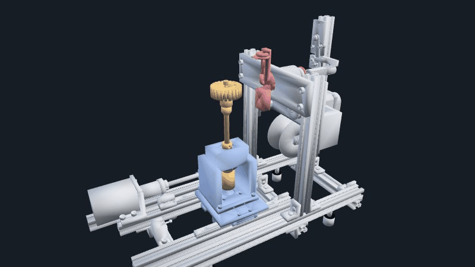

# Stator Winder

Parametric CAD, simulation, and validation tooling for a four-axis flyer
winding machine for small BLDC stators.

> [!WARNING]
> This is an engineering research prototype, not a production-ready machine.
> It has not completed physical winding, endurance, electrical-safety, or
> operator-safety qualification. The current release logic intentionally keeps
> hardware motion fail-closed.

The project models the complete mechanism in Python, derives controller
settings from the geometry, captures the real controller's motion contract,
and audits collisions, wire routing, loads, printability, and procurement
readiness before hardware is purchased.

[](docs/engineering-status.md)

_Generated from the captured upstream-motion simulation. This is a mechanism
visualization, not physical-process or production evidence._

## Project status

- Parametric machine, tooling, and fixture source is present.
- The controller protocol and upstream motion sequence are captured and tested.
- Extensive rigid-body, conductor-path, manufacturing, and procurement audits
  are implemented.
- The selected rigid geometry has useful simulation evidence, but the complete
  moving conductor path and physical process are not yet qualified.
- The launch matrix remains **0/24 production-authorized configurations**.
- No claim is made that this design is safe to build or operate without an
  independent engineering and safety review.

The detailed working state lives in
[`docs/engineering-status.md`](docs/engineering-status.md), and open release
work is tracked in [`TODO.md`](TODO.md).

## Architecture

| Axis | Role | Current mechanical approach |
| --- | --- | --- |
| M0 | Stator carriage | Dual MGN12 rails and a T8x8 lead screw |
| M1 | Stator index | Direct-drive, continuously rotating workholder |
| M2 | Flyer | Belt-driven hollow shaft, balanced arm, and wire guide |
| M3 | Tension | Passive felt drag and spring dancer; motor mount reserved |

The default verification envelope covers 28–65 mm stator OD, 5–20 mm stack
height, 3–8 mm shafts, and 0.20–0.50 mm magnet wire. Those are modeling inputs,
not qualified production limits.

The machine is designed around the command and motion contract of
[`aotenjo-xyz/winder`](https://github.com/aotenjo-xyz/winder). That MIT-licensed
project remains a separate dependency and is not copied into this repository.
The project-owned adapter is deliberately narrow and preserves the upstream
serial protocol.

## Repository map

```text
cad/          parametric mechanism, parts, drawings, and CAD audits
controller/   fail-closed entry point around the separate upstream controller
docs/         requirements, engineering status, and RFQ material
print/        proof-coupon and slicer-profile tooling
sim/          capture, kinematics, collision, conductor, and release audits
bom.csv       purchasing candidates and qualification state
TODO.md       open engineering and release blockers
```

Generated CAD, reports, media, and locally downloaded supplier models are not
tracked. They are reproducible or externally licensed artifacts rather than
project source.

## Quick start

Python 3.11 is the currently verified runtime. On Windows PowerShell:

```powershell
git clone https://github.com/ntindle/stator-winder.git
git clone https://github.com/aotenjo-xyz/winder.git
Set-Location stator-winder
py -3.11 -m venv .venv
.venv\Scripts\python.exe -m pip install -r requirements-dev.txt
.venv\Scripts\python.exe -m playwright install chromium
.venv\Scripts\python.exe cad\settings_gen.py --spindle er11
```

Keep the two checkouts as siblings, or pass `--winder` explicitly to
`controller/run.py` and `sim/capture.py`.

Run the source-only smoke checks:

```powershell
.venv\Scripts\python.exe -m unittest discover -s sim -p "test_controller_adapter.py"
.venv\Scripts\python.exe -m unittest discover -s cad -p "test_settings_gen.py"
```

Many geometry and release tests require supplier CAD cached under
`cad/models/`. Those files are intentionally not redistributed here. See
[`cad/models/README.md`](cad/models/README.md) and the adjacent provenance
reports before running the full suite.

## Typical workflow

```powershell
# Generate settings from the current geometry
.venv\Scripts\python.exe cad\settings_gen.py --spindle er11

# Export the legacy controller-compatible assembly and collision links
.venv\Scripts\python.exe cad\assembly.py
.venv\Scripts\python.exe cad\export_links.py --spindle er11

# Capture the untouched upstream motion stream
.venv\Scripts\python.exe sim\capture.py `
  --controller upstream `
  --settings out\settings.yml `
  -o out\capture\upstream_current_raw.jsonl

# Reconstruct and audit it
.venv\Scripts\python.exe sim\verify_cycle.py `
  --capture out\capture\upstream_current_raw.jsonl `
  --report out\reports\upstream_current_raw_cycle.json `
  --expect-controller upstream
.venv\Scripts\python.exe sim\collide.py `
  --workers 1 `
  --capture out\capture\upstream_current_raw.jsonl `
  --output out\reports\clearance_upstream_raw.json
.venv\Scripts\python.exe sim\wirepath.py `
  --capture out\capture\upstream_current_raw.jsonl `
  --output out\reports\wirepath_upstream_raw.json
```

Several release commands are expected to return nonzero while a safety or
evidence gate remains open. A nonzero result must not be bypassed merely to
produce a green report.

## Origin and third-party material

The mechanical source in this repository was independently parameterized from
the project's requirements. Publicly visible product photos, documentation,
patent publications, and conventional flyer-winder architecture were used to
understand function and failure modes; their images and geometry are not
included.

The separate Aotenjo controller established the compatibility contract. COTS
dimensions and locally cached supplier models were used for fit and collision
work. Because several of those downloads have vendor-only or unclear
redistribution terms, the public source tree excludes all supplier CAD,
datasheets, product photos, converted previews, and community models.

See [`PROVENANCE.md`](PROVENANCE.md) and [`NOTICE.md`](NOTICE.md) for the exact
boundary. Licensing a repository does not grant rights in third-party patents,
trademarks, reference media, or supplier CAD.

## Licensing

- Project software and documentation: [MIT](LICENSE)
- Original mechanical design source: your choice of MIT or
  [CERN-OHL-P-2.0](LICENSES/CERN-OHL-P-2.0.txt)
- Third-party dependencies and locally cached reference assets: their own
  terms; they are not covered by the project license and are not included in
  the public source snapshot

The precise file-scope rules are in [`LICENSES/README.md`](LICENSES/README.md).

Copyright 2026 Nicholas Tindle.
